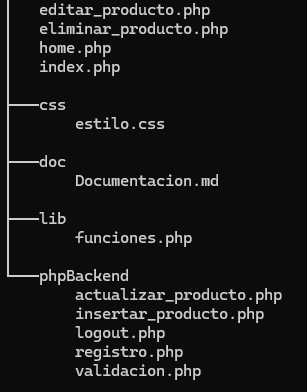

# Proyecto Gestión de Productos - 1º DAM
Introducción a PHP y MySQL. Aplicación web con sistema de login y CRUD.

## Tecnologías utilizadas
* **Lenguaje:** PHP 8.x
* **BD:** MySQL / MariaDB
* **Estilos:** CSS3
* **Servidor:** XAMPP

## Funcionalidades
- [x] Formulario de **Login** y **Registro**.
- [x] Gestión de **Sesiones** de usuario.
- [x] **CRUD** completo de la tabla productos (Crear, Leer, Editar, Eliminar).
- [x] Restricción de acceso para **Administrador**.
- [X] Dispone de una hoja e estilos CSS

## Instalación
1. Clona el repositorio en tu carpeta `htdocs`.
2. Importa el archivo `database.sql` en phpMyAdmin.
3. Configura el archivo `lib/funciones.php` con tus credenciales.

## Estructura del proyecto
* `/css`: Hoja de estilos.
* `/lib`: Biblioteca de funciones propias.
* `/phpBackend`: Lógica de validación y procesos.
* `./home.php`: Página principal, dónde ocurre todo. Home de los usuarios
* `./index.php`: Formulario de inicio de sesión/registro.


## - Explicación de código -

En este bloque nos dedicaremos a **explicar** los bloques necesarios, archivo por archivo, **si este require** de alguna explicación.

Cabe explicar, el funcionamiento del código es el siguiente:
* Los archivos que están en la raíz [home, index...] son los que el usuario va a ver, y las funciones que se hacen detrás, para ordenarlo mejor, están en otros archivos, que cuando el formulario se envía, lo redirige a ese archivo con los datos con un POST, y allí se hace la función... sea tanto comprobar si puede iniciar sesión, o actualizar un producto.
  * Validación.php
  * logout.php
  * ...

***ESTRUCTURA***
### 

### Index.php 
Este es bastante sencillo, las explicaciónes están comentadas, ya que no puedo señalar, encuentro más cómodo hacer comentarios explicando en las respectivas partes a las que quiero hacer referencia: 
```php
# -- Session_Start va a repetirse en casi todas las páginas, porque esto mantiene al 
# -- usuario iniciado sesión, para que podamos acceder a las variables $_SESSION
session_start();
require_once 'lib/funciones.php'; # --> Importa la libreria 

if(isset($_SESSION['usuario'])) {
    header("Location: home.php");
    exit();
}

# -- En este gran condicional, después de haber rellenado el formulario de registro nos devuelve a index con un número con get, para comprobar si no dió errores (de ahí el uno e isset.) Y en ese caso muestra arriba del todo un cuadro de texto indicandonos que el usuario pudo registrarse con éxito.

if (isset($_GET['registrado']) && $_GET['registrado'] == '1') {
    echo '<p style="color: green; font-weight: bold; background: #eaffea; padding: 10px; border: 1px solid green;">';
    echo '¡Registro completado con éxito! Ya puedes iniciar sessión.';
    echo '</p>';
} elseif (isset($_GET['error'])){ # --> Pasa a este bloque si es un error.
    echo '<p style="color: red; font-weight: bold; background: #ffeaea; padding: 10px; border: 1px solid red;">';
    
    if ($_GET['error'] == 'duplicado') { # --> si el contenido es "duplicado" es ya 
        echo 'Aquest usuari ja existeix.'; # es que ya existe en la BD.
    } else {
        echo 'El usuario o la contraseña son incorrectos / El usuario no existe.';
    }
    echo '</p>';
}

?>
```

### Home.php
#### 1. Estructura
El documento está seccionado en 3 partes, la primera es el PHP. La segunda es el HTML que verá tanto el usuario como el admin. Y por última la que solo podrá ver el admin,está es muy importante de explicar;
Básicamente descubrí que si abres un bloque PHP, dentro creas un **if** con su condición y cierras el bloque php, **PERO NO CIERRAS EL CORCHETE TODAVÍA**, adjuntas un bloque HTML y luego abres de nuevo un bloque PHP, y **cierras** el if, el bloque HTML que haya dentro solo se verá si se cumple la condición. Es muy curioso, aquí es como ha de verse:
```php
<?php # -- > Primer bloque PHP
# ------------------------ PRIVILEGIOS DEL ADMIN -----------------------------
if ($nombreUsuario == "admin"){
?>
    <br><hr><br>
    <h1>Privilegios del administrador</h1>

     <h2>Añadir un nuevo producto</h2>
        <form action="./phpBackend/insertar_producto.php" method="POST">
            <label>Nombre del Producto:</label>
            <input type="text" name="nombre" required>

            <label>Descripción:</label>
            <textarea name="descripcion"></textarea>

            <label>Talla:</label>
            <select name="talla">
                <option value="S">S</option>
                <option value="M">M</option>
                <option value="L">L</option>
                <option value="XL">XL</option>
            </select>

            <label>Precio:</label>
            <input type="number" name="precio" required>

            <label>Stock:</label>
            <input type="number" name="stock" required>

            <button type="submit">Guardar Producte</button>
        </form>

<?php # -- > Segundo bloque PHP cerrando el IF
}
# ------------------------ RESTO DEL HTML ------------------------------------
?>
```
#### 2. Tabla de productos
Esta es la tabla de los productos que existen en la BD, extrayendo los datos de la BD:
Primero hacemos una conexión a la BD y lo guardamos en una variable para cuando utilicemos comandos de mysql no repetir código llamando a la función.

```php
require_once "lib/funciones.php"; #Importamos la librería
$conexion = conectarBD(); #Usamos la función para ahorrarnos código de la biblioteca de funciones creada.

$sql = "SELECT * FROM productos";
$resultado = mysqli_query($conexion, $sql);
```
No tiene mucho misterio, "mysqli_data_seek" establecemos el punto de partida, y con el bucle while recorremos todos los atributos de la tabla y luego avanzamos al siguiente, y lo imprimimos con un td para que se separen.
**Además**, si el nombre del usuario es "admin", imprime al final dos enlaces que nos envía a cada archivo respectivamente del clicado.
  
```php
<section>
            <h3>Llistat complet de productes</h3>
            <table>
                <thead>
                    <tr>
                        <th>ID</th>
                        <th>Nombre</th>
                        <th>Talla</th>
                        <th>Precio</th>
                        <th>Stock</th>
                        <th>Acciones</th>
                    </tr>
                </thead>
                <tbody>
                    <?php
                    // Volvemos a recorrer el resultado para la tabla
                    mysqli_data_seek($resultado, 0); 
                    while ($producto = mysqli_fetch_assoc($resultado)) {
                        echo "<tr>";
                        echo "<td>" . $producto['id'] . "</td>";
                        echo "<td>" . $producto['nombre'] . "</td>";
                        echo "<td>" . $producto['talla'] . "</td>";
                        echo "<td>" . $producto['precio'] . "€</td>";
                        echo "<td>" . $producto['stock'] . "</td>";
                        echo "<td>";

                    if ($nombreUsuario == "admin") {
                            echo "<a href='editar_producto.php?id={$producto['id']}'>Editar</a> | ";
                            echo "<a href='eliminar_producto.php?id={$producto['id']}' onclick=\"return confirm('Estás seguro?')\">Eliminar</a>";
                        }
                    }
                    ?>

                    
                </tbody>
            </table>
        </section>
    </main>
```

### Validación.php
Para finalizar, creo que convendría explicar un par de conceptos de este archivo. Este archivo es uno de los tantos que sirven como archivo que "trabaja detrás", el cual expliqué al comienzo.
El usuario llega a este archivo al envíar el formulario, y este hace una consulta a la BD y comprueba si el usuario y la contraseña coinciden con las almacenadas en la BD. Al hacer esta comprobación nos brindara 1 si todo está correcto, por lo que mientras que el resultado de la busqueda sea mayor a 0, (0=error), asignaremos a $_SESSIOn el usuario, para que esté identificado, y lo mandamos al home.

```php
<?php
session_start();

require_once "../lib/funciones.php"; #Importamos la librería
$conexion = conectarBD(); #Usamos la función para ahorrarnos código de la biblioteca de funciones creada.

// Recoger datos del formulario
$user = $_POST['usuario'];
$pass = $_POST['password'];

// Consulta a la BD
$sql = "SELECT * FROM usuarios WHERE nombre_usuario = '$user' AND password = '$pass'";
$resultado = mysqli_query($conexion, $sql);

// Comprobar si hay alguna fila que coincida
if (mysqli_num_rows($resultado) > 0) {
    $_SESSION['usuario'] = $user; #Estamos guardando el nombre de usuario del usuario en una variable global, que siempre que esté la sesión iniciada, podremos leerla.
    header("Location: ../home.php");
} else {
    header("Location: ../index.php?error=1");
}
?>
```